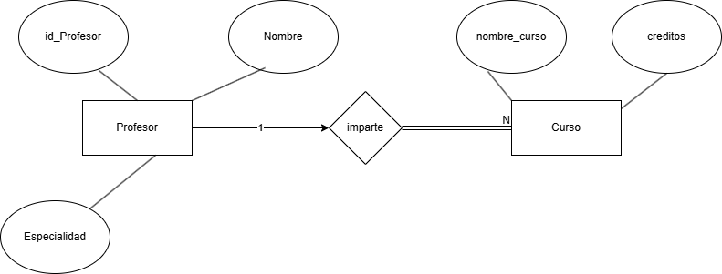

# Ejercicio 1

Un hospital registra información de sus pacientes.

> **De cada paciente se almacena:**
>
> - Número de paciente que lo identifica
> - Nombre
> - Fecha de nacimiento

> **De cada expediente médico se almacena:**
>
> - Número de expediente
> - Fecha de apertura
> - Tipo de sangre

> **Reglas del negocio:**
>
> 1. Cada paciente debe tener exactamente un expediente médico.
> 2. Cada expediente médico pertenece a un único paciente.
> 3. No puede existir un expediente sin paciente.
> 4. No puede existir un paciente sin expediente.

> **Qué se debe realizar:**
>
> - Identificar las entidades.
> - Identificar los atributos.
> - Dibujar las relaciones.
> - Determinar la cardinalidad.
> - Determinar la participación de cada entidad.

# Ejercicio 2

Una universidad administra profesores y cursos.

> **De cada profesor se almacena:**
>
> - Número de profesor
> - Especialidad
> - Nombre

> **De cada curso se almacena:**
>
> - Número de curso
> - Nombre del curso
> - Créditos

> **Reglas del negocio:**
>
> 1. Un profesor puede impartir varios cursos.
> 2. Un curso solamente puede ser impartido por un profesor.
> 3. Puede existir un profesor que actualmente no imparta cursos.
> 4. Todo curso debe estar asignado a un profesor.

